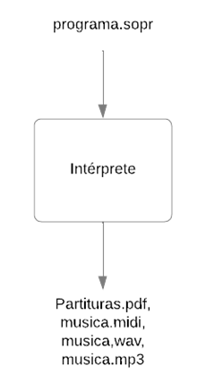

# Intérprete para lenguaje de programación Soprano

## Soprano
Soprano es un lenguaje de programación musical orientado a la composición algorítmica. Es decir, que compone música mediante algoritmos, usando estructuras definidas y una sintaxis específica.
Soprano permite escribir programas sencillos de forma similar a los lenguajes de programación habituales como C, Python o Java. 
Su gramática está escrita con ANTLR y python.

**Compilar gramática**
```shell
antlr4 -Dlanguage=Python3 -no-listener -visitor soprano.g
```
> Este comando creará el analizador léxico (SopranoLexer.py) y el analizador sintáctico (SopranoParser.py) y además generará otros archivos correspondientes, como el archivo para los tokens.

## Intérprete
Su función principal radica en tomar composiciones algorítmicas escritas en el lenguaje Soprano y convertirlas en partituras digitales acompañadas de archivos de sonido que dan vida a la melodía concebida por el compositor. 

**Ejecutar prueba**
```shell
python3 test.py input.txt
```



## Programas externos
* LilyPond: Para generar las partituras. Lilypond ya genera MIDI y PDF. 
* timidity++: Para generar WAV a partir de MIDI. 
* ffmpeg: Para generar MP3 a partir de WAV.

## Agradecimientos
Zaira Zuviría
Lucas Bazilio
