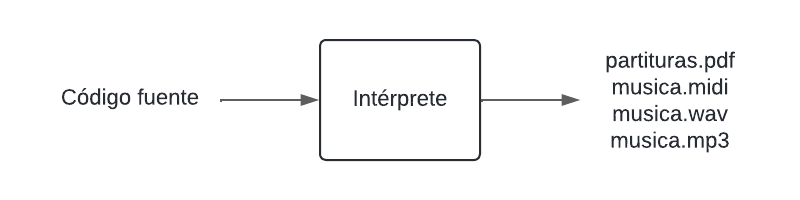

# Intérprete para lenguaje de programación Soprano

## Soprano
Soprano es un lenguaje de programación musical orientado a la composición algorítmica. Es decir, que compone música mediante algoritmos, usando estructuras definidas y una sintaxis específica.
Soprano permite escribir programas sencillos de forma similar a los lenguajes de programación habituales como C, Python o Java. 
Su gramática está escrita con ANTLR y python.

## Intérprete
Su función principal es tomar composiciones algorítmicas escritas en el lenguaje Soprano y convertirlas en partituras digitales acompañadas de archivos de sonido que dan vida a la melodía concebida por el compositor. 


**Ejecutar prueba**
En linux:
(Desde el directorio raíz del repositorio)

```shell
user@user: ~/proyecto_soprano/Soprano-web$ ./run_flask.sh
```
> run_flask.sh navega al directorio de la app de flask, activa el entorno virtual de python, instala las librerías necesarias y ejecuta un servidor de Flask en modo depuración en la url http://127.0.0.1:5000.

**Compilar gramática**
```shell
antlr4 -Dlanguage=Python3 -no-listener -visitor soprano.g
```
> Este comando no es necesario para correr el programa pero fue el que generó la mayoría de los archivos de la carpeta SopranoGrammar, como el analizador léxico (sopranoLexer.py), el analizador sintáctico (sopranoParser.py) y otros archivos correspondientes a la gramática de Soprano como el archivo de tokens (soprano.tokens).

## Programas externos
* LilyPond: Para generar las partituras. MIDI y PDF. 
* timidity++: Para generar WAV a partir de MIDI. 
* ffmpeg: Para generar MP3 a partir de WAV.

## Agradecimientos a instructores
- Zaira Zuviría
- Lucas Bazilio
