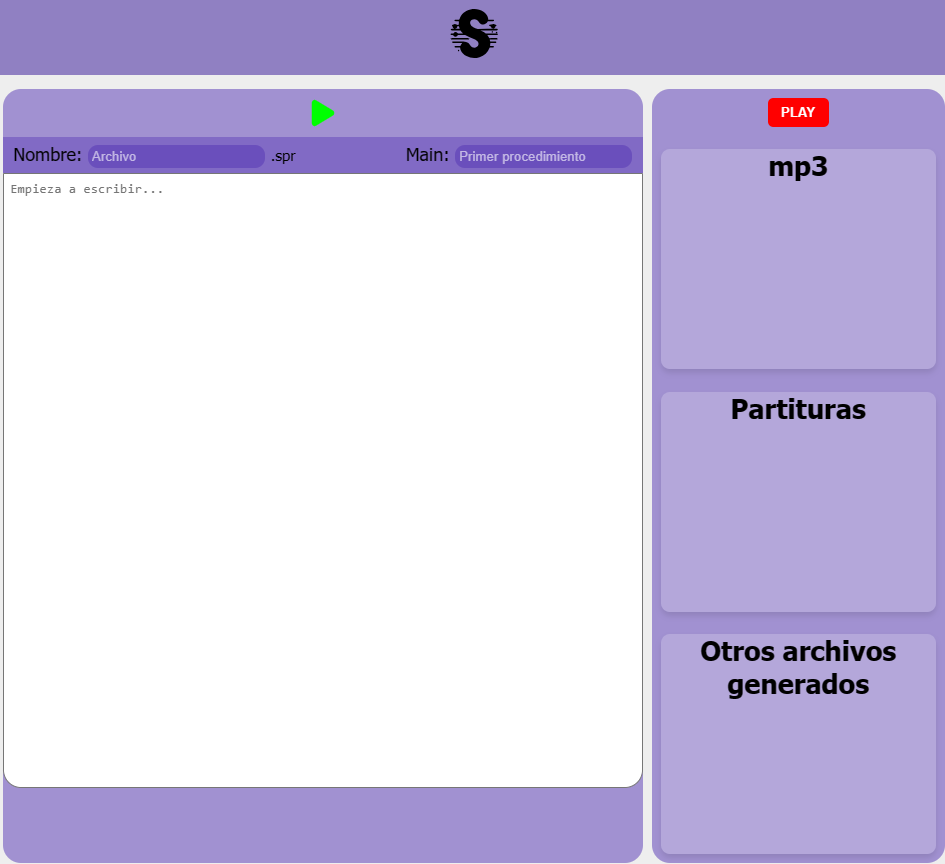

# Intérprete para lenguaje de programación Soprano
Soprano es un lenguaje de programación orientado a la composición algorítmica.  Es decir, que puedes componer música mediante algoritmos, usando estructuras definidas y una sintaxis específica. 

Su sintaxis está basada en la sintaxis musical y en otros lenguajes de programación como C y Python.

El intérprete encargado de traducir un programa escrito en Soprano genera 1 archivo pdf con las partituras y 3 archivos con la melodía en distintos formatos: un archivo .wav, un archivo .midi y un archivo .mp3.

> Anuncio: ¡Pronto estará disponible Soprano en la web!🌐 Apoya el proyecto⭐



## Iniciar Soprano localmente 
**En linux**
1. Copia el repositorio en tu máquina y ve a la raíz del directorio.
2. Pega el comando:

```shell
./run_flask.sh
```
> run_flask.sh navega al directorio de la app de flask, activa el entorno virtual de python, instala las dependencias necesarias y ejecuta un servidor de Flask en modo depuración en la url http://127.0.0.1:5000.

## ¿Cómo funciona?
El intérprete encargado de traducir un programa escrito en Soprano genera 1 archivo pdf con las partituras y 3 archivos con la melodía en distintos formatos: un archivo .wav, un archivo .midi y un archivo .mp3.


### Gramática

La gramática de Soprano está descrita con ANTLR, puedes encontrarla en el archivo Soprano-web/SopranoApp/SopranoGrammar/soprano.g.

Soprano permite escribir programas sencillos de forma similar a los lenguajes de programación habituales como C, Python o Java. 

**Compilar gramática**
```shell
antlr4 -Dlanguage=Python3 -no-listener -visitor soprano.g
```
> Este comando no es necesario para correr el programa y no necesitas usarlo a menos que cambies tu gramática desde el archivo *soprano.g*. Este comando altera la mayoría de los archivos de la carpeta SopranoGrammar, como el analizador léxico (sopranoLexer.py), el analizador sintáctico (sopranoParser.py) y otros archivos que describen la gramática de Soprano, como el archivo de tokens (soprano.tokens).

### Intérprete
El intérprete implementa Visitors, estos visitors son funciones escritas en Python que representan a un token o a una regla gramatical y tiene toda la lógica o instrucciones a ejecutar al pasar por ese token o regla. 

Aquí se manejan los errores y se lanzan exepciones para comprobar la sintáxis y la semántica.

Su función principal es tomar composiciones algorítmicas escritas en lenguaje Soprano y convertirlas en partituras digitales acompañadas de los archivos de sonido correspondientes a la melodía creada por el compositor.


### Manejo de errores
El intérprete detecta los errores sintácticos y semánticos comúnes al escribir código, como:
1. Mala sintaxis en palabras reservadas.
2. Variables o funciones sin declarar.
3. Llaves o paréntesis sin cerrar.
4. Número de parámetros incorrectos en los procedimientos.

## Programas externos
* LilyPond: Para generar las partituras. MIDI y PDF. 
* timidity++: Para generar WAV a partir de MIDI. 
* ffmpeg: Para generar MP3 a partir de WAV.

## Agradecimientos a instructores
- Zaira Zuviría; por impartir el curso de compiladores I y por haber ayudado con la redacción de un resumen para la participación en la Primera Jornada de Investigación 2024.
- Lucas Bazilio; por haber implementado una sintaxis completa, ayudando a cumplir los requerimientos y superando las expectativas de Soprano.
